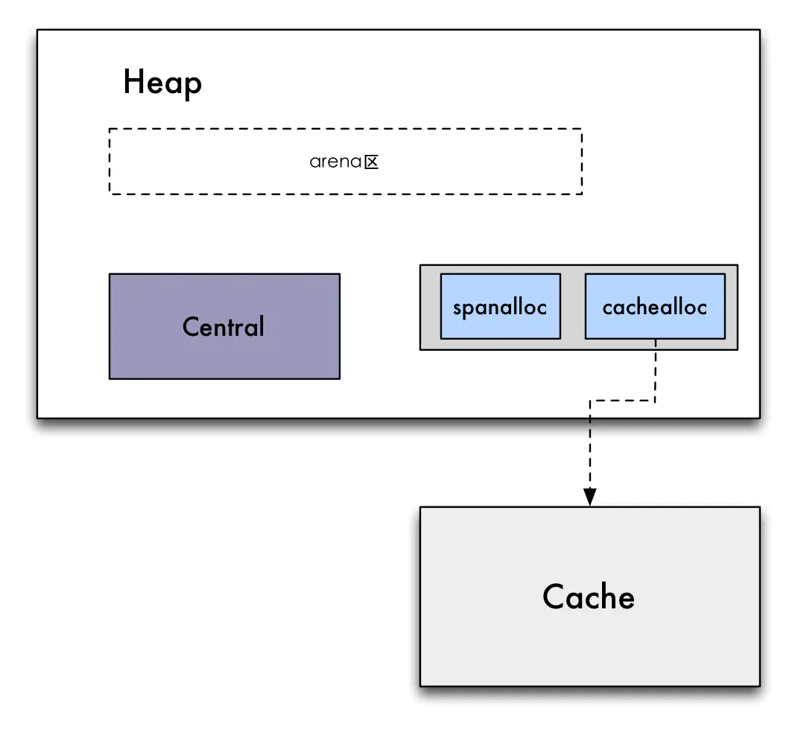

## Go内存管理机制

### 一.关于Go语言内存机制相关的概念

#### 1.Go语言的内存划分是什么意思？

​		Go的内存划分这个概念，强调的是Go的内存管理机制中按照存储的数据的功能类型不同，来划分成不同的数据功能模块。

​		比如按照功能模块(存放对象的堆区功能模块，辅助进行GC垃圾回收的bitmap区(位图)功能模块)，具体存储对象的mheap区

mentral,mcache区等。

#### 2.Go语言的内存空间分配机制概念

​		Go的内存空间分配机制这个概念强调的是当我在Go程序中创建一个对象，声明一个变量的时候，我用什么样的规则和判断逻辑来确定这些变量存储在哪块内存空间中，或者说把哪块内存空间给到这个变量或者对象进行存储使用，而这些内存空间	(mheap,mcentral,mcache三个空间模块)又如何协调和管理Go的这些对象和变量的。

#### 3.Go语言的内存模型

​		Go的内存模型和Java的内存模型要解决的问题类似。

​		我们回忆下Java的内存模型其中有一个问题就是如何让一个共享变量在多线程间具有可见性，具体是一个线程修改了这个共享变量，另外一个线程立刻能感知到其修改的值。

​		这其中涉及到指令重排序，happens-before原则，内存屏障等知识点，马老师的JVM课程均有讲解，这里不重复赘述了。

​		Go的语言的内存模型要解决的也是这个问题。

​		简单的来说，Go的语言的内存模型设定是一种处理规则和机制，

​		这个处理规则和机制规定了在多个协程间(goroutine间)访问一个公有的共享变量时，共享变量被一个goroutine修改后是否可以被另外的goroutine立刻感知到（可见性），或者说在多goroutines下指令如何进行重排序的规则。

​	   Go语言的内存模型第一个是规定了这种共享变量是否可见，什么时候可见的规则，另外就是什么时候会导致多goroutines指令重排序

会有并发安全问题。Go语言的内存模型是一种规则，如果想要在这个规则上保证Go语言的线程安全性，共享变量可见性，则需要使用Go并发编程包的一系列工具类(结构体)。

#### 4.Go语言的GC(垃圾回收)算法

​		Go的垃圾收集算法这个概念强调的是在Go语言为变量分配内存空间后，当这些变量废弃后如何把这块内存重新利用的问题，这个和其它语言中的GC概念也是基本一致的。

### 二.我们这篇文档主要讲的是什么内容？

​		我们这篇文档会讲解Go语言的内存空间是如何按照功能模块划分的，还有就是Go在为变量申请内存空间时的内存分配逻辑，最后再加上Go的GC机制相关的内容。

​		再次重复，我们讲解的是如下：

#### 		1.Go的内存划分

#### 		2.Go的内存分配机制

#### 		3.Go的GC机制相关内容


### 二.Go语言采用了什么内存分配（重点是分配！！）算法？

#### 	Go语言采用了  TCMalloc 算法。

。。。待补

###  三.概述

Go语言的内存管理是由Go语言自己的一个系统线程处理的，具体申请内存，释放内存垃圾回收等操作逻辑就是用Go自己本身的这个语言写的。

管理Go内存机制的这块Go语言代码是属于Go的系统库。

位于${GOPATH}/src/runtime包下

比如其中有一个核心文件就是${GOPATH}/src/runtime/malloc.go

### 四.Go语言的内存管理相关源码是什么语言实现的？

​	Go在1.10版本之前是用的c语言的代码实现的内存管理机制。

​	Go在1.10版本之后改变了方式，都是使用的本身自己的Go语言实现的内存管理机制。

​	

​	

三.Go的源码包结构和说明

### 五.Go是如何向操作系统申请内存并自己管理的？

​		在GoSDK1.14版本之后，Go的内存分配机制相关代码完全是由Go自己这门语言编写的了。

​		也就是说Go从操作系统申请到的内存是自己管理的。

​		那我们先来问一个问题，比如Go一开始向操作系统申请4G内存，此时你的电脑内存使用量会随之增加4G吗？

​		比如你电脑16G内存，你运行了Go程序，此时你的电脑剩余可以使用的内存还是16G左右还是少了4G变成12G了？

​		答案是：你的电脑还是接近16G,启动Go程序的时候并不会真正的消耗和使用掉4G，而是具体的当你Go中的对象和变量逐渐

增多，你真实使用的内存才会增多。

​		这是因为操作系统的一个机制，虚拟内存管理机制。

​		注意，虚拟内存机制是基于操作系统的，面向的是所有在此操作系统上运行的程序。

​		也就是说，即使你是用的是Java语言开发的程序，你在JVM中设置了-Xms4g,只要你的内存够，就能跑起来，但是不会直接占用你4G的内存，因为JVM也是申请的虚拟内存地址。

​		那么我们接下来简单讲讲虚拟内存地址是一个怎么样的原理？

​		要理解虚拟地址，我们首先要问，什么是虚拟地址，它和我们说的物理内存地址有什么区别？

​		而物理内存地址又和我们的硬件内存条有什么关系？为什么不直接使用物理内存，还要加一个虚拟内存机制的机制？

​		我们从内存条和物理内存地址讲起：

​		内存条(比如一般的笔记本都是8G,16G的)的本质是一种存储器，它是用来存储程序在运行时的数据的。

​		我们做一个比喻：

​        。。。待补


### 六.Go内存中各个模块的划分和功能

我们先来看一个图，然后看看图的的模块对应下面源码中的哪些变量。

我们的所有内存管理机制都是通过mheap这个结构体管理的，在下图中Heap实际上指的就是mheap结构体对象，

我们一定把这张图和下面的代码对着看，一个个变量对照着看才比较好。

整体结构我先用文字简单概括一下，下面也有图：

所有的内存管理都在mheap这个结构体中完成。

mheap(堆结构体)

​			注意:这里我们先不用理解每个模块是做什么用的，只要知道结构关系就行。、

​			下面我们会有专门的部分去讲每个模块的作用和各模块之间的关联关系。

​		成员变量1(一级成员)：模块名(模块名只是便于理解)【spans】，真实代码变量名：【allspans】 ，真实变量类型【 []*mspan 】

​		成员变量2(一级成员)：模块名：【arena】,真实代码变量名：【arenas】，

​										真实变量类型【[1 << arenaL1Bits]*[1 << arenaL2Bits]*heapArena】

​		成员变量3(一级成员):  模块名【central】，真实代码变量名【central】，真实变量类型：【[numSpanClasses]struct{...}】

​		  	




下面是go源码的mheap结构，我已经把不重要的删除掉了，只留下了关键的对应图中结构的部分。

#### mheap源码数据结构

```
type mheap struct {
  
   //第一模块：这个对应上图中的spans模块
   allspans []*mspan // all spans out there

   //第二个模块： 
   //64位windows上：一维数组的长度是:1<<6 = 1*2的六次方= 64
   //61位windows上，二维数组的长度是:
   arenas [1 << arenaL1Bits]*[1 << arenaL2Bits]*heapArena

   //第三大模块
   central [numSpanClasses]struct {
      mcentral mcentral
      pad      [cpu.CacheLinePadSize - unsafe.Sizeof(mcentral{})%cpu.CacheLinePadSize]byte
   }
	
   //	 
   spanalloc             fixalloc // allocator for span*
   cachealloc            fixalloc // allocator for mcache*
   
}   
```

#### heapArena源码数据结构

```
type heapArena struct {
   // bitmap stores the pointer/scalar bitmap for the words in
   // this arena. See mbitmap.go for a description. Use the
   // heapBits type to access this.
   bitmap [heapArenaBitmapBytes]byte

   // spans maps from virtual address page ID within this arena to *mspan.
   // For allocated spans, their pages map to the span itself.
   // For free spans, only the lowest and highest pages map to the span itself.
   // Internal pages map to an arbitrary span.
   // For pages that have never been allocated, spans entries are nil.
   //
   // Modifications are protected by mheap.lock. Reads can be
   // performed without locking, but ONLY from indexes that are
   // known to contain in-use or stack spans. This means there
   // must not be a safe-point between establishing that an
   // address is live and looking it up in the spans array.
   spans [pagesPerArena]*mspan

   // pageInUse is a bitmap that indicates which spans are in
   // state mSpanInUse. This bitmap is indexed by page number,
   // but only the bit corresponding to the first page in each
   // span is used.
   //
   // Reads and writes are atomic.
   pageInUse [pagesPerArena / 8]uint8

   // pageMarks is a bitmap that indicates which spans have any
   // marked objects on them. Like pageInUse, only the bit
   // corresponding to the first page in each span is used.
   //
   // Writes are done atomically during marking. Reads are
   // non-atomic and lock-free since they only occur during
   // sweeping (and hence never race with writes).
   //
   // This is used to quickly find whole spans that can be freed.
   //
   // TODO(austin): It would be nice if this was uint64 for
   // faster scanning, but we don't have 64-bit atomic bit
   // operations.
   pageMarks [pagesPerArena / 8]uint8

   // zeroedBase marks the first byte of the first page in this
   // arena which hasn't been used yet and is therefore already
   // zero. zeroedBase is relative to the arena base.
   // Increases monotonically until it hits heapArenaBytes.
   //
   // This field is sufficient to determine if an allocation
   // needs to be zeroed because the page allocator follows an
   // address-ordered first-fit policy.
   //
   // Read atomically and written with an atomic CAS.
   zeroedBase uintptr
}
```


### 七.Go内存管理机制的组件概念

#### 1.Go语言的内存容器有三大组件：

分别是mheap堆组件，mcentral组件，mcache组件。


#### mheap:	

​		mheap是最外层内存容器，它包含着mcentral内存组件和mcache内存组件

​		具体体现为mheap有那两个组件的成员变量。

#### mcentral:

​		在mheap中有一个mcentral数组(后面有源码)，数组长度是67，每一个mcentral中存储的单个对象大小不同，按单个对象大小不同分为67个mcentral(对象大小问题和内存分配的关系一会第三章有讲）

#### mcache:

​		go语言中mcache的概念和Java JVM中的栈内存类似，每启动一个线程对应一个mcache内存空间。

​		mcentral和mheap是所有线程共享的内存空间

这三个内存容器组成了一个三级缓存的内存申请架构。

大对象(超过32k,为啥是32k后面有)，直接在mheap中申请内存。

小对象，先在mcache中申请，没有的话从mcentral拿来一些内存放到mcache中，然后放入mcache,如果mcache存放的过多了，会把一部分迁移到mcentral中，如果mcentral过多了，会迁移到mheap中，最后还不够会通过mheap向操作系统申请内存。

-------

#### 2.Go语言中的对象是存储在什么结构中的？

Go语言中有一个组件，叫做mspan,这个mspan在mheap,mcentral,mcache中的成员变量都能找到，

mspan可以存储大对象，也可以存储小对象。

mspan是存储数据的最基本类，它存储数据的原理是：

mspan被赋予了一块连续的内存空间，然后mspan这个结构体(类)它有有四个比较重要成员属性，分别是：

```
//uintptr是一个数值类型，存储的是一个指针地址
//startAddr代表的是这个mspan的起始内存地址是多少
startAddr uintptr
```

```
//mspan虚拟出一个page的角色，实际上没有这个结构体，只是虚拟抽象概念
//它想实现的一种存储结构类似于    mspan上有多个页page,每个页上有多个obj对象
npages    uintptr 
```

```
// Object n starts at address n*elemsize + (start << pageShift).
//实际上访问的时候只需要算出是第几个对象*单个对象占内存空间大小+mspan起始偏移量即可算出下一个对象应该放到哪里。
freeindex uintptr
// TODO: Look up nelems from sizeclass and remove this field if it
// helps performance.
//这个mspan放入了多少个对象，就是上上面的Object n的个数
nelems uintptr // number of object in the span.
```

所以根据上面我们可以看出来，数据是存储在mspan中的，然后mspan记录了它自己的起始内存地址，存储了多个个对象之类的，每个对象多大，然后通过这些一算就能算出来下一个要放在哪个位置上。

### 八.Go中大小对象的概念

#### 1.go语言中的小对象是什么意思？

​		小于等于32k的对象就是小对象。

#### 2.go语言中的大对象？

​		大于32k的对象都是大对象

#### 3.对象大小和内存分配有什么关系？

​		go语言中很奇葩，它内部内存申请机制，是根据申请对象所占内存空间大小来区分具体放入到哪个结构体对象中的。

​	   比如，有个分类属性，sizeclass,这个属性是一个int值，从0-66，一共67个数，代表了67类不同内存大小的对象(单个对象占用)。

​		下面有表格，可以详细看数据。

​		它mcentral组件和mache组件中存储数据的mspan,都和67有关，也就是说，小对象上来判断你的所申请的内存在0-32k中的哪一个区间，然后给你放入匹配的对应那个mspan中去，不同的mspan结构体对象，里面存储的单个对象内存块大小不同。

​		不管是这三个内存组件的哪一个，一般存储都是用67个mspan，每个mspan代表了只装这一种内存大小的对象，然后mspan是一个双向链表，不够了往后添加就行。	

​		go语言中分配内存的机制，首先要根据申请对象所占内存空间的大小来决定，如果是小对象(小于等于32k)，走的是三级缓存的内存管理机制(先从mcache申请，没有再从mcentral申请，最后还不够放入mheap中)，如果是大对象，会直接会向堆申请内存空间(具体细节后面详细讲)

​		这样区分对象大小来分配内存有两个好处：	

​		 1).减少内存碎片。

​		 2).便于管理，提高内存分配和释放的速度。

#### 4.go语言中大对象如何分配内存？

​		go语言中超过32k的对象都是大对象，大对象的类型编号classsize(这个编号用于表示不同的对象占用内存大小)为0，会直接从mheap(后面详细讲mheap)中申请内存空间，会把数据存储在mheap的成员变量allspans中，后面源码能看到那个成员变量，不会经过mcache组件和mcentral组件。

#### 5.go语言中小对象如何申请内存？

​		go语言中小对象是指小于32k的对象，go会先判断要申请的小对象的大小，然后根据下面的这张表找到对应的class编号：

```
const (
   _MaxSmallSize   = 32768
   smallSizeDiv    = 8
   smallSizeMax    = 1024
   largeSizeDiv    = 128
	// class  bytes/obj  bytes/span  objects  tail waste  max waste
   //表示在新创建对象时，按照对象占用内存空间的大小，可以在67种不同的内存大小分类(按单个对象所占大小分类，看下面表格)中挑选一个    //最合适的，最大的对象在go语言中也归类为小对象，最大的小对象32k。
   _NumSizeClasses = 67
   _PageShift      = 13
)
```

```
说明一下span和对象(obj)的关系
我们在go中如何创建一个对象，或者一个变量都是叫做一个obj,也就是下面的第二列。
而我们的多个obj是装在一个span中管理的，span是一个容器，装着多个obj对象，
class是一个类型的型号编码，这个类型型号中的类型是按一个对象(obj)占用内存的大小来区分的，也就是
不同的class对应的obj所申请占用的一块内存空间大小不一样，第四列是objects，代表一个span能装多少个obj，objects是一个数量，
第五列是指内存浪费的字节，也就是看下下面的公式：
一个对象占的字节数*对象个数+不连续的小碎片浪费的内存空间=一个span的空间大小
obj(bytes)*objects+tail waste(bytes) = span(bytes)
注意，我们就是从这张表中得知go语言中的大对象和小对象是如何划分的，
拉到这张标的最后面，一个对象的最大字节数是32768bytes
而我们计算一下32768/1024=32(KB)
所以Go语言中的67种对象大小分类中，最大的也就是32k,这也可以验证了
超过32k的大对象是不会走mcahe和central这两个内存容器的，直接会在mheap中申请内存
//  7   10   50
 	7     7   7
	7+1=8     10-8 = 2 *  
// class  bytes/obj  bytes/span 	 objects  tail waste  max waste
//     1          8        8192(8M)     1024           0     87.50%

		7*1024 = 7168
		7168 / 8192 = 87.50%
		
		(((objsize-real_objsize) * objects)+tail_waste) /spansize

//     2         16        8192      512           0     43.75%
//     3         32        8192      256           0     46.88%
//     4         48        8192      170          32     31.52%
	
		((c.size - (preSize+1)) * objects + tailWaste) / spanSize
			((48-(32+1)*170)*170+32 )/8192
//     5         64        8192      128           0     23.44%
//     6         80        8192      102          32     19.07%
//     7         96        8192       85          32     15.95%
//     8        112        8192       73          16     13.56%
//     9        128        8192       64           0     11.72%
//    10        144        8192       56         128     11.82%
//    11        160        8192       51          32      9.73%
//    12        176        8192       46          96      9.59%
//    13        192        8192       42         128      9.25%
//    14        208        8192       39          80      8.12%
//    15        224        8192       36         128      8.15%
//    16        240        8192       34          32      6.62%
//    17        256        8192       32           0      5.86%
//    18        288        8192       28         128     12.16%
//    19        320        8192       25         192     11.80%
//    20        352        8192       23          96      9.88%
//    21        384        8192       21         128      9.51%
//    22        416        8192       19         288     10.71%
//    23        448        8192       18         128      8.37%
//    24        480        8192       17          32      6.82%
//    25        512        8192       16           0      6.05%
//    26        576        8192       14         128     12.33%
//    27        640        8192       12         512     15.48%
//    28        704        8192       11         448     13.93%
//    29        768        8192       10         512     13.94%
//    30        896        8192        9         128     15.52%
//    31       1024        8192        8           0     12.40%
//    32       1152        8192        7         128     12.41%
//    33       1280        8192        6         512     15.55%
//    34       1408       16384       11         896     14.00%
//    35       1536        8192        5         512     14.00%
//    36       1792       16384        9         256     15.57%
//    37       2048        8192        4           0     12.45%
//    38       2304       16384        7         256     12.46%
//    39       2688        8192        3         128     15.59%
//    40       3072       24576        8           0     12.47%
//    41       3200       16384        5         384      6.22%
//    42       3456       24576        7         384      8.83%
//    43       4096        8192        2           0     15.60%
//    44       4864       24576        5         256     16.65%
//    45       5376       16384        3         256     10.92%
//    46       6144       24576        4           0     12.48%
//    47       6528       32768        5         128      6.23%
//    48       6784       40960        6         256      4.36%
//    49       6912       49152        7         768      3.37%
//    50       8192        8192        1           0     15.61%
//    51       9472       57344        6         512     14.28%
//    52       9728       49152        5         512      3.64%
//    53      10240       40960        4           0      4.99%
//    54      10880       32768        3         128      6.24%
//    55      12288       24576        2           0     11.45%
//    56      13568       40960        3         256      9.99%
//    57      14336       57344        4           0      5.35%
//    58      16384       16384        1           0     12.49%
//    59      18432       73728        4           0     11.11%
//    60      19072       57344        3         128      3.57%
//    61      20480       40960        2           0      6.87%
//    62      21760       65536        3         256      6.25%
//    63      24576       24576        1           0     11.45%
//    64      27264       81920        3         128     10.00%
//    65      28672       57344        2           0      4.91%
//    66      32768       32768        1           0     12.50%
```

### 九.源码数据结构

#### 1.mheap结构体

```
type mheap struct {

   //这个对象数组是mheap中自己管理的内存容器
   allspans []*mspan // all spans out there

   
   //areans这个变量 存储着一些位图信息，位图信息用于垃圾收集时标记清楚。。。
   arenas [1 << arenaL1Bits]*[1 << arenaL2Bits]*heapArena


   //重点！！！！！
   //central数组对象是一个重要的容器
   //central的本质时一个匿名的结构体数组
   //这个写法声明一个匿名结构体数组变量，变量名为central
   central [numSpanClasses]struct {
   	  //这个是具体的类，里面有mspan数组，再里面存储数据
      mcentral mcentral
      pad      [cpu.CacheLinePadSize - unsafe.Sizeof(mcentral{})%cpu.CacheLinePadSize]byte
   }

   spanalloc             fixalloc // allocator for span*
   cachealloc            fixalloc // allocator for mcache*
   specialfinalizeralloc fixalloc // allocator for specialfinalizer*
   specialprofilealloc   fixalloc // allocator for specialprofile*
   speciallock           mutex    // lock for special record allocators.
   arenaHintAlloc        fixalloc // allocator for arenaHints

   unused *specialfinalizer // never set, just here to force the specialfinalizer type into DWARF
}
```

#### 2.核心mcentral

```
type mcentral struct {
   //真正存储数据的mspan,	mSpanList里头是mspan
   //这两个配合存储数据(这个详细的区别说明下次加上)
   nonempty  mSpanList // list of spans with a free object, ie a nonempty free list
   empty     mSpanList // list of spans with no free objects (or cached in an mcache)

   // nmalloc is the cumulative count of objects allocated from
   // this mcentral, assuming all spans in mcaches are
   // fully-allocated. Written atomically, read under STW.
   nmalloc uint64
}
```

#### 3.mSpanList(装着多个span的列表结构体)

```
type mSpanList struct {
   //头节点mspan(引用类型)	
   first *mspan // first span in list, or nil if none
   //尾部节点mspan(引用类型)
   last  *mspan // last span in list, or nil if none
}
```

#### 4.mspan(正真存储数据的结构体，类)

```
//mspan是一个双向链表结构
type mspan struct {
   //下一个span节点  如果空的话填none
   next *mspan     // next span in list, or nil if none
   //上一个span节点 如果空的话填none
   prev *mspan     // previous span in list, or nil if none
   list *mSpanList // For debugging. TODO: Remove.
	
   //当前span的起始内存地址
   startAddr uintptr // address of first byte of span aka s.base()
   //当前的span有几页数据
   //一个span有多个page
   npages    uintptr // number of pages in span

   manualFreeList gclinkptr // list of free objects in mSpanManual spans

   // freeindex is the slot index between 0 and nelems at which to begin scanning
   // for the next free object in this span.
   // Each allocation scans allocBits starting at freeindex until it encounters a 0
   // indicating a free object. freeindex is then adjusted so that subsequent scans begin
   // just past the newly discovered free object.
   //
   // If freeindex == nelem, this span has no free objects.
   //
   // allocBits is a bitmap of objects in this span.
   // If n >= freeindex and allocBits[n/8] & (1<<(n%8)) is 0
   // then object n is free;
   // otherwise, object n is allocated. Bits starting at nelem are
   // undefined and should never be referenced.
   //
   // Object n starts at address n*elemsize + (start << pageShift).
   freeindex uintptr
   // TODO: Look up nelems from sizeclass and remove this field if it
   // helps performance.
   nelems uintptr // number of object in the span.

   // Cache of the allocBits at freeindex. allocCache is shifted
   // such that the lowest bit corresponds to the bit freeindex.
   // allocCache holds the complement of allocBits, thus allowing
   // ctz (count trailing zero) to use it directly.
   // allocCache may contain bits beyond s.nelems; the caller must ignore
   // these.
   allocCache uint64

   // allocBits and gcmarkBits hold pointers to a span's mark and
   // allocation bits. The pointers are 8 byte aligned.
   // There are three arenas where this data is held.
   // free: Dirty arenas that are no longer accessed
   //       and can be reused.
   // next: Holds information to be used in the next GC cycle.
   // current: Information being used during this GC cycle.
   // previous: Information being used during the last GC cycle.
   // A new GC cycle starts with the call to finishsweep_m.
   // finishsweep_m moves the previous arena to the free arena,
   // the current arena to the previous arena, and
   // the next arena to the current arena.
   // The next arena is populated as the spans request
   // memory to hold gcmarkBits for the next GC cycle as well
   // as allocBits for newly allocated spans.
   //
   // The pointer arithmetic is done "by hand" instead of using
   // arrays to avoid bounds checks along critical performance
   // paths.
   // The sweep will free the old allocBits and set allocBits to the
   // gcmarkBits. The gcmarkBits are replaced with a fresh zeroed
   // out memory.
   allocBits  *gcBits
   gcmarkBits *gcBits

   // sweep generation:
   // if sweepgen == h->sweepgen - 2, the span needs sweeping
   // if sweepgen == h->sweepgen - 1, the span is currently being swept
   // if sweepgen == h->sweepgen, the span is swept and ready to use
   // if sweepgen == h->sweepgen + 1, the span was cached before sweep began and is still cached, and needs sweeping
   // if sweepgen == h->sweepgen + 3, the span was swept and then cached and is still cached
   // h->sweepgen is incremented by 2 after every GC

   sweepgen    uint32
   divMul      uint16        // for divide by elemsize - divMagic.mul
   baseMask    uint16        // if non-0, elemsize is a power of 2, & this will get object allocation base
   allocCount  uint16        // number of allocated objects
   //当前span的sizeclass，也就是大小类型，必然是67种的一种	
   spanclass   spanClass     // size class and noscan (uint8)
   state       mSpanStateBox // mSpanInUse etc; accessed atomically (get/set methods)
   needzero    uint8         // needs to be zeroed before allocation
   divShift    uint8         // for divide by elemsize - divMagic.shift
   divShift2   uint8         // for divide by elemsize - divMagic.shift2
   elemsize    uintptr       // computed from sizeclass or from npages
   limit       uintptr       // end of data in span
   speciallock mutex         // guards specials list
   specials    *special      // linked list of special records sorted by offset.
}
```

### 十.初始化流程

首先列一个层级架构:

​			1.最底层mheap(和操作系统内存打交道)

​					mheap中包含着mache组件和mcentral组件

​					mheap向操作系统申请内存空间，然后分配给mcentral

​			2.第二级mcentral组件

​			3.第一级mcache组件(小对象最优先看这个可不可以申请内存)		

Go会在程序运行时调用一个内存管理初始化的函数mallocinit

如下：

在这个方法中会初始化堆组件(堆组件结构体名称叫mheap)

```
func mallocinit() {
	//...
	// Initialize the heap.
	//初始化堆  注意：对象变量名叫mheap_，结构体类型定义是mheap
	mheap_.init()
	//...
	//初始化核心组件mcache
	_g_.m.mcache = allocmcache()
	//...
}
```

接下来一切都要围绕着这个mheap堆组件来展开了

我们来看看这个mheap结构体里面的关键组成部分：

```}
type mheap struct {
	//一.mheap管理的重要内存组件！！！！！
	//mheap堆自己管理的容器组件，大对象申请直接放到这里，mcache和mcentral中的对象过多也会迁移到这里一部分
	allspans []*mspan // all spans out there
	
	//二.重点！！！！核心内存组件二 central 
	central [numSpanClasses]struct {
		mcentral mcentral
		pad      [cpu.CacheLinePadSize - unsafe.Sizeof(mcentral{})%cpu.CacheLinePadSize]byte
	}
	
	//span分配器，用于申请内存创建span容器
	spanalloc       fixalloc // allocator for span*
	
	//三.内存容器组件三是mcache，只不过在别处通过cachealloc分配器进行创建的
	//mcache分配器，用于创建mcache，只不过在别处创建的组件
	mcachealloc      fixalloc // allocator for mcache*
}
```

在下面这里才初始化了mcache

```
// Initialize the heap.
mheap_.init()
_g_ := getg()
//这一步骤真正的初始化了Cache内存组件
_g_.m.mcache = allocmcache()
```

我们看看它内部是如何实现的：

```
// dummy mspan that contains no free objects.
//空的mspan容器，回忆一下，真正的对象是存储在哪里？
//mspan--->page---->obj
var emptymspan mspan

func allocmcache() *mcache {
   var c *mcache
   systemstack(func() {
      lock(&mheap_.lock)
      //1.核心步骤(1)调用alloc方法创建*mcache指针对象
      c = (*mcache)(mheap_.cachealloc.alloc())
      c.flushGen = mheap_.sweepgen
      unlock(&mheap_.lock)
   })
   //2.核心步骤(2)
   for i := range c.alloc {
   	  //为c(这个c就是mcache组件)分配控的mspan,这样之后数据装入mspan中就可以了 	
      c.alloc[i] = &emptymspan
   }
   //这里瞄了一眼，类似于递归
   c.next_sample = nextSample()
   return c
}
```

核心组件mcache(每个线程都有一个)

```
type mcache struct {
  
   // The rest is not accessed on every malloc.
   //重点看这里！！！！！
   //mcahe这个组件中的数据都存在这里！！！！   存在这个长度为67的mspan数组中
   //存储数据的时候先根据对象申请的内存大小匹配到67个mspan中的合适大小的那个mspan，然后mspan是个链表，
   //在mspan链表后添加一个mspan,把数据存进去即可，记住mcache这个结构体中的都是存储的小对象
   //numSpanClasses=67,每个代表一个size大小类型，参考前面的size表格
   alloc [numSpanClasses]*mspan // spans to allocate from, indexed by spanClass
}
```

go语言中cache的概念和Java JVM中的栈内存类似，每启动一个线程对应一个cache，

Central和Heap是所有线程共享的。

```
// Initialize the heap.
//初始化mheap
func (h *mheap) init() {
   //spanalloc是一个span内存管理分配器，调用spanalloc的init方法初始化hmeap中的allspans([]mspan类型)数组
   //allspans([]mspan类型)数组实质上就是hmeap的内存容器，大对象都是存储在这里的，cache和central中的小对象太多了的时候
   //也会把一部分迁移到allspans([]mspan类型)这个内存容器当中
   h.spanalloc.init(unsafe.Sizeof(mspan{}), recordspan, unsafe.Pointer(h), &memstats.mspan_sys)
   h.cachealloc.init(unsafe.Sizeof(mcache{}), nil, nil, &memstats.mcache_sys)
   h.specialfinalizeralloc.init(unsafe.Sizeof(specialfinalizer{}), nil, nil, &memstats.other_sys)
   h.specialprofilealloc.init(unsafe.Sizeof(specialprofile{}), nil, nil, &memstats.other_sys)
   h.arenaHintAlloc.init(unsafe.Sizeof(arenaHint{}), nil, nil, &memstats.other_sys)

   // Don't zero mspan allocations. Background sweeping can
   // inspect a span concurrently with allocating it, so it's
   // important that the span's sweepgen survive across freeing
   // and re-allocating a span to prevent background sweeping
   // from improperly cas'ing it from 0.
   //
   // This is safe because mspan contains no heap pointers.
   h.spanalloc.zero = false

   // h->mapcache needs no init

   for i := range h.central {
      h.central[i].mcentral.init(spanClass(i))
   }

   h.pages.init(&h.lock, &memstats.gc_sys)
}
```

### 十一.详解Go执行流程

我们要想运行一个Go的程序，有两种方式：

​			1.在我们开发的时候，我们自己用go run  go程序文件运行go程序。

​			2.我们可以把Go程序编译成一个二进制的可执行程序，然后在对应的电脑上直接运行。

​			那其中里面到底是怎么一个流程呢?

​			实际上，在windows平台，比如第一种，在你用go run运行你的go程序的时候，真正先执行的是go.exe这个二进制文件，你的后面传的程序文件名路径只是作为go.exe 的其中一个参数。

​			也就是说，它是怎么调用你的main函数的呢？因为是执行go.exe，所以他可以这样：

​	(下面为了便于理解，大大的简化了复杂的流程和细节，想看细节的话可以往后面翻)

​		1).go.exe ：(go.exe是一个二进制程序，它的源码包含两部分，一部分是.s结尾的汇编程序文件，一部分是.go结尾的go自身SDK源码程序文件，最后这两种会打包成go.exe一个二进制文件) 

​			go.exe开始的汇编代码块会执行一些go系统逻辑，比如向操作系统申请一块虚拟内存地址，比如创建建GMP模型中的p结构体对象，m结构体对象，创建一个g结构体对象，这个g结构体对象是一个main  goroutine,然后再 main goroutine 中调用runtime.main,之后进行一些列操作等等。

​		2).然后初始化好了，会开始取出你的程序，找到你的main包main函数，调用一下。

​		这样你就感觉好像是直接运行了你自己的go程序main函数一样。

​		如果不是用go.exe运行呢？直接把程序编译成二进制文件呢？

​		实际上是一样的，只不过这个时候它把go.exe中的逻辑和你的程序拼接在一起打了一个二进制包，实际上本质上和第一种用go.exe的方式运行go程序是一样的。

​	。。。待补	

​	


​		在初始化过程中我们要梳理清楚一个大体的调用关系：

​		1.上面在我们的go.exe程序执行的时候，它实际上首先运行的是汇编语言的代码：

​			   (这里我们简单讲一下，在GoSDK的源码包中，实际上关于启动Go程序的汇编程序有好多个，电脑在真正运行的时候只会根据当前系统的cpu判断出使用哪一种汇编语言指令集(我们可以简单粗糙的理解为每种cpu对应一种汇编语言，每种汇编语言写法有些小小区别，要想要cpu能执行我们的汇编代码，得用其cpu型号对应支持能识别的汇编语言编写才行)，然后启动对应汇编指令的一个Go程序启动方法）

​			比如我们看看这个asm_amd64.s文件，这是一个汇编源码文件：			

```
//导入包...
#include "go_asm.h"
#include "go_tls.h"
#include "funcdata.h"
#include "textflag.h"
//程序启动
//注意下面 runtime是哪里来的？上面include包中带的，
//TEXT是什么？ 在汇编语言中TEXT后面代表可执行代码
//rt0_go这个方法就是Go程序真正的启动入口
TEXT runtime·rt0_go(SB),NOSPLIT,$0
   // copy arguments forward on an even stack
   MOVQ   DI, AX    // argc
   MOVQ   SI, BX    // argv
   SUBQ   $(4*8+7), SP      // 2args 2auto
   ANDQ   $~15, SP
   MOVQ   AX, 16(SP)
   MOVQ   BX, 24(SP)
   
   // create istack out of the given (operating system) stack.
   // _cgo_init may update stackguard.
```